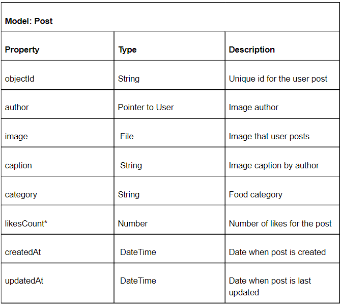
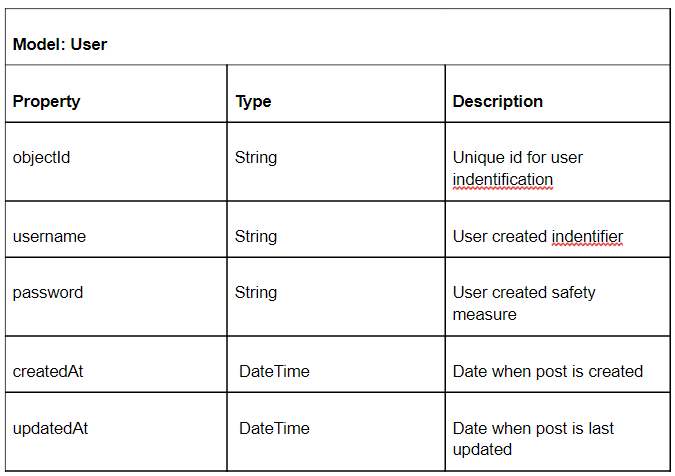

# College COOKbook

## Table of Contents
1. [Overview](#Overview)
1. [Product Spec](#Product-Spec)
1. [Wireframes](#Wireframes)
2. [Schema](#Schema)

## Overview
This is an repository for the College Cookbook app. As a college student, planning meals can be a struggle and sometimes we just need simple and quick recipes to help us powerup for class or studying. 

### Description
This app will allow college students to look up recipes based on categories (i.e. italian, under 5 minutes, minumum resources, etc.) and create easy meals. This app can help  in planning meals with the ingredients and resources available to them.

### App Evaluation
- **Category:** Food & Drink
- **Mobile:** Android
- **Story:** College students can search recipes in a selected category. 
- **Market:** College Students
- **Habit:** College students will use this when planning meals with the ingredients and resources available to them.
- **Scope:** See Required User Stories

## Product Spec

### 1. User Stories (Required and Optional)

**Required Must-have Stories**

- [x] User can login
- [x] User can logout
- [x] User can Create an account
- [ ] User can post their own recipes
- [ ] User can view other user's posted recipes
- [ ] User can search recipes by available ingredients, resources or user profile.
- [ ] User can view/edit their own profile

**Optional Nice-to-have Stories**

* User can like/unlike a recipe
* User can comment on posts

### 2. Screen Archetypes
* Login/Register
    * User can login
    * User can create an account
* Stream
    * User can view other user's posted recipes
* Creation
    * User can post their own recipes
* Profile
    * User can view/edit their own profile
    * User can logout
* Search 
    * User can search recipes by available ingredients, resources or user profile.
* Detail
    * User can view/edit their own profile
    * User can view other user's posted recipes
   
### 3. Navigation

**Tab Navigation** (Tab to Screen)
* Home/Feed
* Post
* Search
* Profile

**Flow Navigation** (Screen to Screen)
* Login/Register
    * Home/Feed after login
* Home/Feed
    * Post Detail when clicking on recipe
* Post
    * Home/Feed after post is submitted
* Search
    * Post Detail when clicking on search result
* Profile
    * Post Detail for user's post
    * Login/Register screen after logging out 

## Wireframes

### [BONUS] Digital Wireframes & Mockups

### [BONUS] Interactive Prototype

## Schema 
### Models

### Networking
* Home/Feed Screen
   * (Read/GET) Query all posts where user is author
   * (Create/POST) Create a new content / like on a post
   * (Delete) Delete existing like / content
* Profile Screen
   * (Read/GET) Query logged in user object
   * (Update/PUT) Update user profile image
* Create Post Screen
   * (Create/POST) Create a new post object
* Detail SCreen
   * (Read/POST) Query all posts where user
* Search Screen 
   * (Read/GET) Query all categories for other users posts
* Login Screen
   * (Read/GET) Query user information for login
    
### API Endpoints (optional)

